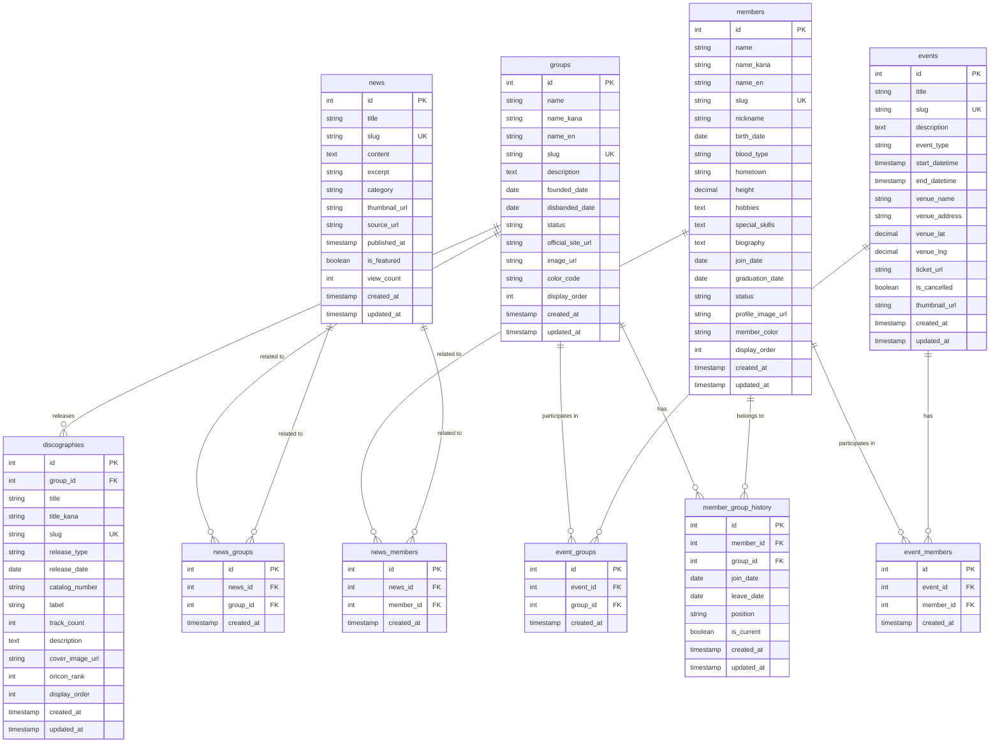

# データベース設計書

## 1. ドキュメント情報

| 項目 | 内容 |
|------|------|
| **プロジェクト名** | helloprojects |
| **文書名** | データベース設計書 |
| **バージョン** | 1.0.0 |
| **作成日** | 2026-01-14 |
| **最終更新日** | 2026-01-14 |

---

## 2. 概要

### 2.1 目的

本書は、ハロープロジェクト総合ファンポータルサイトのデータベース設計を定義します。

### 2.2 データベース管理システム

- **DBMS**: PostgreSQL 15.x 以上
- **ORM**: Prisma 5.x 以上

### 2.3 設計方針

- 正規化を適切に行い、データの整合性を保つ
- パフォーマンスを考慮したインデックス設計
- 多対多のリレーションは中間テーブルを使用
- タイムスタンプ（作成日時・更新日時）を全テーブルに設定
- 論理削除（ソフトデリート）は必要に応じて実装

---

## 3. テーブル定義

### 3.1 groups（グループ情報）

グループの基本情報を管理するテーブル。

#### 3.1.1 カラム定義

| カラム名 | データ型 | 制約 | 説明 |
|---------|---------|------|------|
| id | SERIAL | PRIMARY KEY | グループID（自動採番） |
| name | VARCHAR(100) | NOT NULL, UNIQUE | グループ名（例: モーニング娘。'26） |
| name_kana | VARCHAR(200) | NULL | グループ名カナ（例: モーニングムスメ） |
| name_en | VARCHAR(200) | NULL | グループ名英語（例: Morning Musume） |
| slug | VARCHAR(100) | NOT NULL, UNIQUE | URLスラッグ（例: morning-musume） |
| description | TEXT | NULL | グループ紹介文 |
| founded_date | DATE | NULL | 結成日 |
| disbanded_date | DATE | NULL | 解散日（現役の場合はNULL） |
| status | VARCHAR(20) | NOT NULL, DEFAULT 'active' | ステータス（active, disbanded, hiatus） |
| official_site_url | VARCHAR(500) | NULL | 公式サイトURL |
| official_blog_url | VARCHAR(500) | NULL | 公式ブログURL |
| twitter_url | VARCHAR(500) | NULL | 公式Twitter URL |
| instagram_url | VARCHAR(500) | NULL | 公式Instagram URL |
| youtube_url | VARCHAR(500) | NULL | 公式YouTube URL |
| image_url | VARCHAR(500) | NULL | グループ画像URL |
| color_code | VARCHAR(7) | NULL | テーマカラー（HEX形式: #FF1493） |
| display_order | INTEGER | NOT NULL, DEFAULT 0 | 表示順序 |
| created_at | TIMESTAMP | NOT NULL, DEFAULT NOW() | 作成日時 |
| updated_at | TIMESTAMP | NOT NULL, DEFAULT NOW() | 更新日時 |

#### 3.1.2 インデックス

```sql
CREATE INDEX idx_groups_status ON groups(status);
CREATE INDEX idx_groups_display_order ON groups(display_order);
CREATE INDEX idx_groups_founded_date ON groups(founded_date);
```

#### 3.1.3 制約

- `status` は CHECK 制約で `('active', 'disbanded', 'hiatus')` のいずれか
- `slug` は小文字英数字とハイフンのみ許可

---

### 3.2 members（メンバー情報）

メンバーの基本情報を管理するテーブル。

#### 3.2.1 カラム定義

| カラム名 | データ型 | 制約 | 説明 |
|---------|---------|------|------|
| id | SERIAL | PRIMARY KEY | メンバーID（自動採番） |
| name | VARCHAR(100) | NOT NULL | 氏名（例: 佐藤優樹） |
| name_kana | VARCHAR(200) | NULL | 氏名カナ（例: サトウマサキ） |
| name_en | VARCHAR(200) | NULL | 氏名英語（例: Masaki Sato） |
| slug | VARCHAR(100) | NOT NULL, UNIQUE | URLスラッグ（例: sato-masaki） |
| nickname | VARCHAR(100) | NULL | ニックネーム（例: まーちゃん） |
| birth_date | DATE | NULL | 生年月日 |
| blood_type | VARCHAR(5) | NULL | 血液型（A, B, O, AB） |
| hometown | VARCHAR(100) | NULL | 出身地（例: 北海道札幌市） |
| height | DECIMAL(5,2) | NULL | 身長（cm） |
| hobbies | TEXT | NULL | 趣味 |
| special_skills | TEXT | NULL | 特技 |
| biography | TEXT | NULL | 経歴・プロフィール |
| join_date | DATE | NULL | ハロープロジェクト加入日 |
| graduation_date | DATE | NULL | 卒業日（現役の場合はNULL） |
| status | VARCHAR(20) | NOT NULL, DEFAULT 'active' | ステータス（active, graduated, trainee） |
| profile_image_url | VARCHAR(500) | NULL | プロフィール画像URL |
| official_blog_url | VARCHAR(500) | NULL | 公式ブログURL |
| twitter_url | VARCHAR(500) | NULL | 公式Twitter URL |
| instagram_url | VARCHAR(500) | NULL | 公式Instagram URL |
| member_color | VARCHAR(7) | NULL | メンバーカラー（HEX形式） |
| display_order | INTEGER | NOT NULL, DEFAULT 0 | 表示順序 |
| created_at | TIMESTAMP | NOT NULL, DEFAULT NOW() | 作成日時 |
| updated_at | TIMESTAMP | NOT NULL, DEFAULT NOW() | 更新日時 |

#### 3.2.2 インデックス

```sql
CREATE INDEX idx_members_status ON members(status);
CREATE INDEX idx_members_name_kana ON members(name_kana);
CREATE INDEX idx_members_join_date ON members(join_date);
CREATE INDEX idx_members_birth_date ON members(birth_date);
```

#### 3.2.3 制約

- `status` は CHECK 制約で `('active', 'graduated', 'trainee')` のいずれか
- `blood_type` は CHECK 制約で `('A', 'B', 'O', 'AB')` のいずれか

---

### 3.3 member_group_history（メンバーのグループ所属履歴）

メンバーがどのグループに所属していたかの履歴を管理する中間テーブル。

#### 3.3.1 カラム定義

| カラム名 | データ型 | 制約 | 説明 |
|---------|---------|------|------|
| id | SERIAL | PRIMARY KEY | 履歴ID（自動採番） |
| member_id | INTEGER | NOT NULL, FOREIGN KEY | メンバーID |
| group_id | INTEGER | NOT NULL, FOREIGN KEY | グループID |
| join_date | DATE | NOT NULL | グループ加入日 |
| leave_date | DATE | NULL | グループ脱退日（現在所属中の場合はNULL） |
| position | VARCHAR(100) | NULL | ポジション（例: リーダー、サブリーダー） |
| is_current | BOOLEAN | NOT NULL, DEFAULT TRUE | 現在所属中かどうか |
| created_at | TIMESTAMP | NOT NULL, DEFAULT NOW() | 作成日時 |
| updated_at | TIMESTAMP | NOT NULL, DEFAULT NOW() | 更新日時 |

#### 3.3.2 インデックス

```sql
CREATE INDEX idx_member_group_history_member_id ON member_group_history(member_id);
CREATE INDEX idx_member_group_history_group_id ON member_group_history(group_id);
CREATE INDEX idx_member_group_history_is_current ON member_group_history(is_current);
CREATE INDEX idx_member_group_history_join_date ON member_group_history(join_date);
```

#### 3.3.3 外部キー

```sql
ALTER TABLE member_group_history
  ADD CONSTRAINT fk_member_group_history_member
  FOREIGN KEY (member_id) REFERENCES members(id) ON DELETE CASCADE;

ALTER TABLE member_group_history
  ADD CONSTRAINT fk_member_group_history_group
  FOREIGN KEY (group_id) REFERENCES groups(id) ON DELETE CASCADE;
```

#### 3.3.4 ユニーク制約

```sql
CREATE UNIQUE INDEX idx_member_group_unique
  ON member_group_history(member_id, group_id, join_date);
```

---

### 3.4 news（ニュース記事）

ニュース・お知らせを管理するテーブル。

#### 3.4.1 カラム定義

| カラム名 | データ型 | 制約 | 説明 |
|---------|---------|------|------|
| id | SERIAL | PRIMARY KEY | ニュースID（自動採番） |
| title | VARCHAR(500) | NOT NULL | タイトル |
| slug | VARCHAR(200) | NOT NULL, UNIQUE | URLスラッグ |
| content | TEXT | NOT NULL | 本文（Markdown形式） |
| excerpt | VARCHAR(500) | NULL | 抜粋・要約 |
| category | VARCHAR(50) | NOT NULL | カテゴリ（event, release, media, other） |
| thumbnail_url | VARCHAR(500) | NULL | サムネイル画像URL |
| source_url | VARCHAR(500) | NULL | 元記事URL（スクレイピング元） |
| published_at | TIMESTAMP | NOT NULL | 公開日時 |
| is_featured | BOOLEAN | NOT NULL, DEFAULT FALSE | 注目記事フラグ |
| view_count | INTEGER | NOT NULL, DEFAULT 0 | 閲覧数 |
| created_at | TIMESTAMP | NOT NULL, DEFAULT NOW() | 作成日時 |
| updated_at | TIMESTAMP | NOT NULL, DEFAULT NOW() | 更新日時 |

#### 3.4.2 インデックス

```sql
CREATE INDEX idx_news_category ON news(category);
CREATE INDEX idx_news_published_at ON news(published_at DESC);
CREATE INDEX idx_news_is_featured ON news(is_featured);
CREATE INDEX idx_news_created_at ON news(created_at DESC);
```

#### 3.4.3 制約

- `category` は CHECK 制約で `('event', 'release', 'media', 'other')` のいずれか

#### 3.4.4 全文検索インデックス

```sql
CREATE INDEX idx_news_title_content_fts ON news
  USING gin(to_tsvector('japanese', title || ' ' || content));
```

---

### 3.5 news_groups（ニュースとグループの関連）

ニュースとグループの多対多リレーションを管理する中間テーブル。

#### 3.5.1 カラム定義

| カラム名 | データ型 | 制約 | 説明 |
|---------|---------|------|------|
| id | SERIAL | PRIMARY KEY | ID（自動採番） |
| news_id | INTEGER | NOT NULL, FOREIGN KEY | ニュースID |
| group_id | INTEGER | NOT NULL, FOREIGN KEY | グループID |
| created_at | TIMESTAMP | NOT NULL, DEFAULT NOW() | 作成日時 |

#### 3.5.2 インデックス

```sql
CREATE INDEX idx_news_groups_news_id ON news_groups(news_id);
CREATE INDEX idx_news_groups_group_id ON news_groups(group_id);
```

#### 3.5.3 外部キー

```sql
ALTER TABLE news_groups
  ADD CONSTRAINT fk_news_groups_news
  FOREIGN KEY (news_id) REFERENCES news(id) ON DELETE CASCADE;

ALTER TABLE news_groups
  ADD CONSTRAINT fk_news_groups_group
  FOREIGN KEY (group_id) REFERENCES groups(id) ON DELETE CASCADE;
```

#### 3.5.4 ユニーク制約

```sql
CREATE UNIQUE INDEX idx_news_groups_unique
  ON news_groups(news_id, group_id);
```

---

### 3.6 news_members（ニュースとメンバーの関連）

ニュースとメンバーの多対多リレーションを管理する中間テーブル。

#### 3.6.1 カラム定義

| カラム名 | データ型 | 制約 | 説明 |
|---------|---------|------|------|
| id | SERIAL | PRIMARY KEY | ID（自動採番） |
| news_id | INTEGER | NOT NULL, FOREIGN KEY | ニュースID |
| member_id | INTEGER | NOT NULL, FOREIGN KEY | メンバーID |
| created_at | TIMESTAMP | NOT NULL, DEFAULT NOW() | 作成日時 |

#### 3.6.2 インデックス

```sql
CREATE INDEX idx_news_members_news_id ON news_members(news_id);
CREATE INDEX idx_news_members_member_id ON news_members(member_id);
```

#### 3.6.3 外部キー

```sql
ALTER TABLE news_members
  ADD CONSTRAINT fk_news_members_news
  FOREIGN KEY (news_id) REFERENCES news(id) ON DELETE CASCADE;

ALTER TABLE news_members
  ADD CONSTRAINT fk_news_members_member
  FOREIGN KEY (member_id) REFERENCES members(id) ON DELETE CASCADE;
```

#### 3.6.4 ユニーク制約

```sql
CREATE UNIQUE INDEX idx_news_members_unique
  ON news_members(news_id, member_id);
```

---

### 3.7 events（イベント・スケジュール）

イベントやスケジュール情報を管理するテーブル。

#### 3.7.1 カラム定義

| カラム名 | データ型 | 制約 | 説明 |
|---------|---------|------|------|
| id | SERIAL | PRIMARY KEY | イベントID（自動採番） |
| title | VARCHAR(500) | NOT NULL | イベント名 |
| slug | VARCHAR(200) | NOT NULL, UNIQUE | URLスラッグ |
| description | TEXT | NULL | イベント詳細説明 |
| event_type | VARCHAR(50) | NOT NULL | イベントタイプ（live, handshake, release, tv, radio, other） |
| start_datetime | TIMESTAMP | NOT NULL | 開始日時 |
| end_datetime | TIMESTAMP | NULL | 終了日時 |
| venue_name | VARCHAR(200) | NULL | 会場名 |
| venue_address | VARCHAR(500) | NULL | 会場住所 |
| venue_lat | DECIMAL(10,8) | NULL | 緯度 |
| venue_lng | DECIMAL(11,8) | NULL | 経度 |
| ticket_url | VARCHAR(500) | NULL | チケット購入URL |
| ticket_price | VARCHAR(200) | NULL | チケット価格情報 |
| source_url | VARCHAR(500) | NULL | 元情報URL |
| is_cancelled | BOOLEAN | NOT NULL, DEFAULT FALSE | 中止フラグ |
| thumbnail_url | VARCHAR(500) | NULL | サムネイル画像URL |
| created_at | TIMESTAMP | NOT NULL, DEFAULT NOW() | 作成日時 |
| updated_at | TIMESTAMP | NOT NULL, DEFAULT NOW() | 更新日時 |

#### 3.7.2 インデックス

```sql
CREATE INDEX idx_events_event_type ON events(event_type);
CREATE INDEX idx_events_start_datetime ON events(start_datetime);
CREATE INDEX idx_events_end_datetime ON events(end_datetime);
CREATE INDEX idx_events_is_cancelled ON events(is_cancelled);
```

#### 3.7.3 制約

- `event_type` は CHECK 制約で `('live', 'handshake', 'release', 'tv', 'radio', 'other')` のいずれか
- `end_datetime` は `start_datetime` より後である必要がある

```sql
ALTER TABLE events
  ADD CONSTRAINT check_events_datetime
  CHECK (end_datetime IS NULL OR end_datetime >= start_datetime);
```

---

### 3.8 event_groups（イベントとグループの関連）

イベントとグループの多対多リレーションを管理する中間テーブル。

#### 3.8.1 カラム定義

| カラム名 | データ型 | 制約 | 説明 |
|---------|---------|------|------|
| id | SERIAL | PRIMARY KEY | ID（自動採番） |
| event_id | INTEGER | NOT NULL, FOREIGN KEY | イベントID |
| group_id | INTEGER | NOT NULL, FOREIGN KEY | グループID |
| created_at | TIMESTAMP | NOT NULL, DEFAULT NOW() | 作成日時 |

#### 3.8.2 インデックス

```sql
CREATE INDEX idx_event_groups_event_id ON event_groups(event_id);
CREATE INDEX idx_event_groups_group_id ON event_groups(group_id);
```

#### 3.8.3 外部キー

```sql
ALTER TABLE event_groups
  ADD CONSTRAINT fk_event_groups_event
  FOREIGN KEY (event_id) REFERENCES events(id) ON DELETE CASCADE;

ALTER TABLE event_groups
  ADD CONSTRAINT fk_event_groups_group
  FOREIGN KEY (group_id) REFERENCES groups(id) ON DELETE CASCADE;
```

#### 3.8.4 ユニーク制約

```sql
CREATE UNIQUE INDEX idx_event_groups_unique
  ON event_groups(event_id, group_id);
```

---

### 3.9 event_members（イベントとメンバーの関連）

イベントとメンバーの多対多リレーションを管理する中間テーブル。

#### 3.9.1 カラム定義

| カラム名 | データ型 | 制約 | 説明 |
|---------|---------|------|------|
| id | SERIAL | PRIMARY KEY | ID（自動採番） |
| event_id | INTEGER | NOT NULL, FOREIGN KEY | イベントID |
| member_id | INTEGER | NOT NULL, FOREIGN KEY | メンバーID |
| created_at | TIMESTAMP | NOT NULL, DEFAULT NOW() | 作成日時 |

#### 3.9.2 インデックス

```sql
CREATE INDEX idx_event_members_event_id ON event_members(event_id);
CREATE INDEX idx_event_members_member_id ON event_members(member_id);
```

#### 3.9.3 外部キー

```sql
ALTER TABLE event_members
  ADD CONSTRAINT fk_event_members_event
  FOREIGN KEY (event_id) REFERENCES events(id) ON DELETE CASCADE;

ALTER TABLE event_members
  ADD CONSTRAINT fk_event_members_member
  FOREIGN KEY (member_id) REFERENCES members(id) ON DELETE CASCADE;
```

#### 3.9.4 ユニーク制約

```sql
CREATE UNIQUE INDEX idx_event_members_unique
  ON event_members(event_id, member_id);
```

---

### 3.10 discographies（ディスコグラフィー）

シングル・アルバムなどのディスコグラフィー情報を管理するテーブル。

#### 3.10.1 カラム定義

| カラム名 | データ型 | 制約 | 説明 |
|---------|---------|------|------|
| id | SERIAL | PRIMARY KEY | ディスコグラフィーID（自動採番） |
| group_id | INTEGER | NOT NULL, FOREIGN KEY | グループID |
| title | VARCHAR(500) | NOT NULL | タイトル |
| title_kana | VARCHAR(500) | NULL | タイトルカナ |
| slug | VARCHAR(200) | NOT NULL, UNIQUE | URLスラッグ |
| release_type | VARCHAR(50) | NOT NULL | リリースタイプ（single, album, mini_album, dvd, blu_ray, other） |
| release_date | DATE | NOT NULL | リリース日 |
| catalog_number | VARCHAR(100) | NULL | カタログ番号 |
| label | VARCHAR(100) | NULL | レーベル名 |
| track_count | INTEGER | NULL | 収録曲数 |
| description | TEXT | NULL | 説明・備考 |
| cover_image_url | VARCHAR(500) | NULL | ジャケット画像URL |
| amazon_url | VARCHAR(500) | NULL | Amazon URL |
| official_url | VARCHAR(500) | NULL | 公式ページURL |
| oricon_rank | INTEGER | NULL | オリコン最高順位 |
| display_order | INTEGER | NOT NULL, DEFAULT 0 | 表示順序 |
| created_at | TIMESTAMP | NOT NULL, DEFAULT NOW() | 作成日時 |
| updated_at | TIMESTAMP | NOT NULL, DEFAULT NOW() | 更新日時 |

#### 3.10.2 インデックス

```sql
CREATE INDEX idx_discographies_group_id ON discographies(group_id);
CREATE INDEX idx_discographies_release_type ON discographies(release_type);
CREATE INDEX idx_discographies_release_date ON discographies(release_date DESC);
CREATE INDEX idx_discographies_display_order ON discographies(display_order);
```

#### 3.10.3 外部キー

```sql
ALTER TABLE discographies
  ADD CONSTRAINT fk_discographies_group
  FOREIGN KEY (group_id) REFERENCES groups(id) ON DELETE CASCADE;
```

#### 3.10.4 制約

- `release_type` は CHECK 制約で `('single', 'album', 'mini_album', 'dvd', 'blu_ray', 'other')` のいずれか

---

## 4. ER図（Mermaid形式）



---

## 5. Prismaスキーマ（schema.prisma）

```prisma
// This is your Prisma schema file,
// learn more about it in the docs: https://pris.ly/d/prisma-schema

generator client {
  provider = "prisma-client-js"
}

datasource db {
  provider = "postgresql"
  url      = env("DATABASE_URL")
}

// グループ情報
model Group {
  id               Int      @id @default(autoincrement())
  name             String   @db.VarChar(100)
  nameKana         String?  @map("name_kana") @db.VarChar(200)
  nameEn           String?  @map("name_en") @db.VarChar(200)
  slug             String   @unique @db.VarChar(100)
  description      String?  @db.Text
  foundedDate      DateTime? @map("founded_date") @db.Date
  disbandedDate    DateTime? @map("disbanded_date") @db.Date
  status           String   @default("active") @db.VarChar(20)
  officialSiteUrl  String?  @map("official_site_url") @db.VarChar(500)
  officialBlogUrl  String?  @map("official_blog_url") @db.VarChar(500)
  twitterUrl       String?  @map("twitter_url") @db.VarChar(500)
  instagramUrl     String?  @map("instagram_url") @db.VarChar(500)
  youtubeUrl       String?  @map("youtube_url") @db.VarChar(500)
  imageUrl         String?  @map("image_url") @db.VarChar(500)
  colorCode        String?  @map("color_code") @db.VarChar(7)
  displayOrder     Int      @default(0) @map("display_order")
  createdAt        DateTime @default(now()) @map("created_at") @db.Timestamp(6)
  updatedAt        DateTime @updatedAt @map("updated_at") @db.Timestamp(6)

  // Relations
  memberGroupHistory MemberGroupHistory[]
  newsGroups         NewsGroup[]
  eventGroups        EventGroup[]
  discographies      Discography[]

  @@index([status])
  @@index([displayOrder])
  @@index([foundedDate])
  @@map("groups")
}

// メンバー情報
model Member {
  id              Int      @id @default(autoincrement())
  name            String   @db.VarChar(100)
  nameKana        String?  @map("name_kana") @db.VarChar(200)
  nameEn          String?  @map("name_en") @db.VarChar(200)
  slug            String   @unique @db.VarChar(100)
  nickname        String?  @db.VarChar(100)
  birthDate       DateTime? @map("birth_date") @db.Date
  bloodType       String?  @map("blood_type") @db.VarChar(5)
  hometown        String?  @db.VarChar(100)
  height          Decimal? @db.Decimal(5, 2)
  hobbies         String?  @db.Text
  specialSkills   String?  @map("special_skills") @db.Text
  biography       String?  @db.Text
  joinDate        DateTime? @map("join_date") @db.Date
  graduationDate  DateTime? @map("graduation_date") @db.Date
  status          String   @default("active") @db.VarChar(20)
  profileImageUrl String?  @map("profile_image_url") @db.VarChar(500)
  officialBlogUrl String?  @map("official_blog_url") @db.VarChar(500)
  twitterUrl      String?  @map("twitter_url") @db.VarChar(500)
  instagramUrl    String?  @map("instagram_url") @db.VarChar(500)
  memberColor     String?  @map("member_color") @db.VarChar(7)
  displayOrder    Int      @default(0) @map("display_order")
  createdAt       DateTime @default(now()) @map("created_at") @db.Timestamp(6)
  updatedAt       DateTime @updatedAt @map("updated_at") @db.Timestamp(6)

  // Relations
  memberGroupHistory MemberGroupHistory[]
  newsMembers        NewsMember[]
  eventMembers       EventMember[]

  @@index([status])
  @@index([nameKana])
  @@index([joinDate])
  @@index([birthDate])
  @@map("members")
}

// メンバーのグループ所属履歴
model MemberGroupHistory {
  id        Int      @id @default(autoincrement())
  memberId  Int      @map("member_id")
  groupId   Int      @map("group_id")
  joinDate  DateTime @map("join_date") @db.Date
  leaveDate DateTime? @map("leave_date") @db.Date
  position  String?  @db.VarChar(100)
  isCurrent Boolean  @default(true) @map("is_current")
  createdAt DateTime @default(now()) @map("created_at") @db.Timestamp(6)
  updatedAt DateTime @updatedAt @map("updated_at") @db.Timestamp(6)

  // Relations
  member Member @relation(fields: [memberId], references: [id], onDelete: Cascade)
  group  Group  @relation(fields: [groupId], references: [id], onDelete: Cascade)

  @@unique([memberId, groupId, joinDate])
  @@index([memberId])
  @@index([groupId])
  @@index([isCurrent])
  @@index([joinDate])
  @@map("member_group_history")
}

// ニュース記事
model News {
  id          Int      @id @default(autoincrement())
  title       String   @db.VarChar(500)
  slug        String   @unique @db.VarChar(200)
  content     String   @db.Text
  excerpt     String?  @db.VarChar(500)
  category    String   @db.VarChar(50)
  thumbnailUrl String? @map("thumbnail_url") @db.VarChar(500)
  sourceUrl   String?  @map("source_url") @db.VarChar(500)
  publishedAt DateTime @map("published_at") @db.Timestamp(6)
  isFeatured  Boolean  @default(false) @map("is_featured")
  viewCount   Int      @default(0) @map("view_count")
  createdAt   DateTime @default(now()) @map("created_at") @db.Timestamp(6)
  updatedAt   DateTime @updatedAt @map("updated_at") @db.Timestamp(6)

  // Relations
  newsGroups  NewsGroup[]
  newsMembers NewsMember[]

  @@index([category])
  @@index([publishedAt(sort: Desc)])
  @@index([isFeatured])
  @@index([createdAt(sort: Desc)])
  @@map("news")
}

// ニュースとグループの関連
model NewsGroup {
  id        Int      @id @default(autoincrement())
  newsId    Int      @map("news_id")
  groupId   Int      @map("group_id")
  createdAt DateTime @default(now()) @map("created_at") @db.Timestamp(6)

  // Relations
  news  News  @relation(fields: [newsId], references: [id], onDelete: Cascade)
  group Group @relation(fields: [groupId], references: [id], onDelete: Cascade)

  @@unique([newsId, groupId])
  @@index([newsId])
  @@index([groupId])
  @@map("news_groups")
}

// ニュースとメンバーの関連
model NewsMember {
  id        Int      @id @default(autoincrement())
  newsId    Int      @map("news_id")
  memberId  Int      @map("member_id")
  createdAt DateTime @default(now()) @map("created_at") @db.Timestamp(6)

  // Relations
  news   News   @relation(fields: [newsId], references: [id], onDelete: Cascade)
  member Member @relation(fields: [memberId], references: [id], onDelete: Cascade)

  @@unique([newsId, memberId])
  @@index([newsId])
  @@index([memberId])
  @@map("news_members")
}

// イベント・スケジュール
model Event {
  id            Int      @id @default(autoincrement())
  title         String   @db.VarChar(500)
  slug          String   @unique @db.VarChar(200)
  description   String?  @db.Text
  eventType     String   @map("event_type") @db.VarChar(50)
  startDatetime DateTime @map("start_datetime") @db.Timestamp(6)
  endDatetime   DateTime? @map("end_datetime") @db.Timestamp(6)
  venueName     String?  @map("venue_name") @db.VarChar(200)
  venueAddress  String?  @map("venue_address") @db.VarChar(500)
  venueLat      Decimal? @map("venue_lat") @db.Decimal(10, 8)
  venueLng      Decimal? @map("venue_lng") @db.Decimal(11, 8)
  ticketUrl     String?  @map("ticket_url") @db.VarChar(500)
  ticketPrice   String?  @map("ticket_price") @db.VarChar(200)
  sourceUrl     String?  @map("source_url") @db.VarChar(500)
  isCancelled   Boolean  @default(false) @map("is_cancelled")
  thumbnailUrl  String?  @map("thumbnail_url") @db.VarChar(500)
  createdAt     DateTime @default(now()) @map("created_at") @db.Timestamp(6)
  updatedAt     DateTime @updatedAt @map("updated_at") @db.Timestamp(6)

  // Relations
  eventGroups  EventGroup[]
  eventMembers EventMember[]

  @@index([eventType])
  @@index([startDatetime])
  @@index([endDatetime])
  @@index([isCancelled])
  @@map("events")
}

// イベントとグループの関連
model EventGroup {
  id        Int      @id @default(autoincrement())
  eventId   Int      @map("event_id")
  groupId   Int      @map("group_id")
  createdAt DateTime @default(now()) @map("created_at") @db.Timestamp(6)

  // Relations
  event Event @relation(fields: [eventId], references: [id], onDelete: Cascade)
  group Group @relation(fields: [groupId], references: [id], onDelete: Cascade)

  @@unique([eventId, groupId])
  @@index([eventId])
  @@index([groupId])
  @@map("event_groups")
}

// イベントとメンバーの関連
model EventMember {
  id        Int      @id @default(autoincrement())
  eventId   Int      @map("event_id")
  memberId  Int      @map("member_id")
  createdAt DateTime @default(now()) @map("created_at") @db.Timestamp(6)

  // Relations
  event  Event  @relation(fields: [eventId], references: [id], onDelete: Cascade)
  member Member @relation(fields: [memberId], references: [id], onDelete: Cascade)

  @@unique([eventId, memberId])
  @@index([eventId])
  @@index([memberId])
  @@map("event_members")
}

// ディスコグラフィー
model Discography {
  id             Int      @id @default(autoincrement())
  groupId        Int      @map("group_id")
  title          String   @db.VarChar(500)
  titleKana      String?  @map("title_kana") @db.VarChar(500)
  slug           String   @unique @db.VarChar(200)
  releaseType    String   @map("release_type") @db.VarChar(50)
  releaseDate    DateTime @map("release_date") @db.Date
  catalogNumber  String?  @map("catalog_number") @db.VarChar(100)
  label          String?  @db.VarChar(100)
  trackCount     Int?     @map("track_count")
  description    String?  @db.Text
  coverImageUrl  String?  @map("cover_image_url") @db.VarChar(500)
  amazonUrl      String?  @map("amazon_url") @db.VarChar(500)
  officialUrl    String?  @map("official_url") @db.VarChar(500)
  oriconRank     Int?     @map("oricon_rank")
  displayOrder   Int      @default(0) @map("display_order")
  createdAt      DateTime @default(now()) @map("created_at") @db.Timestamp(6)
  updatedAt      DateTime @updatedAt @map("updated_at") @db.Timestamp(6)

  // Relations
  group Group @relation(fields: [groupId], references: [id], onDelete: Cascade)

  @@index([groupId])
  @@index([releaseType])
  @@index([releaseDate(sort: Desc)])
  @@index([displayOrder])
  @@map("discographies")
}
```

---

## 6. リレーション図

### 6.1 主要リレーション

```
groups (1) ←→ (多) member_group_history ←→ (多) members (1)
└─ 多対多リレーション（履歴テーブルを介する）

groups (1) ←→ (多) news_groups ←→ (多) news (1)
└─ 多対多リレーション

members (1) ←→ (多) news_members ←→ (多) news (1)
└─ 多対多リレーション

groups (1) ←→ (多) event_groups ←→ (多) events (1)
└─ 多対多リレーション

members (1) ←→ (多) event_members ←→ (多) events (1)
└─ 多対多リレーション

groups (1) ←→ (多) discographies
└─ 1対多リレーション
```

### 6.2 カーディナリティ

| リレーション | カーディナリティ | 説明 |
|-------------|----------------|------|
| groups ↔ member_group_history | 1対多 | 1つのグループは複数のメンバー所属履歴を持つ |
| members ↔ member_group_history | 1対多 | 1人のメンバーは複数のグループ所属履歴を持つ |
| news ↔ news_groups | 1対多 | 1つのニュースは複数のグループと関連 |
| groups ↔ news_groups | 1対多 | 1つのグループは複数のニュースと関連 |
| news ↔ news_members | 1対多 | 1つのニュースは複数のメンバーと関連 |
| members ↔ news_members | 1対多 | 1人のメンバーは複数のニュースと関連 |
| events ↔ event_groups | 1対多 | 1つのイベントは複数のグループが参加 |
| groups ↔ event_groups | 1対多 | 1つのグループは複数のイベントに参加 |
| events ↔ event_members | 1対多 | 1つのイベントは複数のメンバーが参加 |
| members ↔ event_members | 1対多 | 1人のメンバーは複数のイベントに参加 |
| groups ↔ discographies | 1対多 | 1つのグループは複数のディスコグラフィーを持つ |

---

## 7. インデックス戦略

### 7.1 インデックス設計方針

1. **主キー**: すべてのテーブルで `id` カラムに自動的に作成
2. **外部キー**: すべての外部キーカラムにインデックスを作成
3. **検索頻度の高いカラム**: `status`, `category`, `event_type` などにインデックスを作成
4. **ソートに使用するカラム**: `published_at`, `start_datetime`, `release_date` などにインデックスを作成（降順）
5. **ユニーク制約**: `slug`, `name` などの一意性が必要なカラムにユニークインデックスを作成
6. **全文検索**: ニュースの `title` と `content` に対して PostgreSQL の全文検索インデックスを作成

### 7.2 パフォーマンス最適化

- 複合インデックスは、WHERE句やJOINで頻繁に使用される組み合わせに対して作成
- 中間テーブルには、両方の外部キーに対する複合ユニークインデックスを作成
- `created_at`, `updated_at` は監査用途のため、通常はインデックス不要（newsのcreated_atは例外）

---

## 8. データ整合性

### 8.1 参照整合性

- すべての外部キー制約は `ON DELETE CASCADE` を設定
- 親レコードが削除された場合、関連する子レコードも自動的に削除される

### 8.2 CHECK制約

以下のカラムにCHECK制約を設定:

```sql
-- groups.status
ALTER TABLE groups
  ADD CONSTRAINT check_groups_status
  CHECK (status IN ('active', 'disbanded', 'hiatus'));

-- members.status
ALTER TABLE members
  ADD CONSTRAINT check_members_status
  CHECK (status IN ('active', 'graduated', 'trainee'));

-- members.blood_type
ALTER TABLE members
  ADD CONSTRAINT check_members_blood_type
  CHECK (blood_type IN ('A', 'B', 'O', 'AB') OR blood_type IS NULL);

-- news.category
ALTER TABLE news
  ADD CONSTRAINT check_news_category
  CHECK (category IN ('event', 'release', 'media', 'other'));

-- events.event_type
ALTER TABLE events
  ADD CONSTRAINT check_events_event_type
  CHECK (event_type IN ('live', 'handshake', 'release', 'tv', 'radio', 'other'));

-- events.end_datetime
ALTER TABLE events
  ADD CONSTRAINT check_events_datetime
  CHECK (end_datetime IS NULL OR end_datetime >= start_datetime);

-- discographies.release_type
ALTER TABLE discographies
  ADD CONSTRAINT check_discographies_release_type
  CHECK (release_type IN ('single', 'album', 'mini_album', 'dvd', 'blu_ray', 'other'));
```

---

## 9. マイグレーション戦略

### 9.1 Prisma Migrate

Prisma Migrateを使用してスキーマ変更を管理:

```bash
# 開発環境でのマイグレーション作成
npx prisma migrate dev --name init

# ステージング/本番環境へのマイグレーション適用
npx prisma migrate deploy

# スキーマからPrisma Clientの生成
npx prisma generate
```

### 9.2 マイグレーション命名規則

- `init` - 初期スキーマ作成
- `add_[table_name]` - 新しいテーブル追加
- `update_[table_name]_[change_description]` - テーブル更新
- `add_index_[table_name]_[column_name]` - インデックス追加
- `fix_[issue_description]` - バグ修正

---

## 10. データ初期化

### 10.1 シードデータ

開発環境用のシードデータを `prisma/seed.ts` に定義:

```typescript
import { PrismaClient } from '@prisma/client';

const prisma = new PrismaClient();

async function main() {
  // グループデータの投入
  const morningMusume = await prisma.group.create({
    data: {
      name: "モーニング娘。'26",
      nameKana: 'モーニングムスメ',
      nameEn: 'Morning Musume',
      slug: 'morning-musume',
      foundedDate: new Date('1997-09-14'),
      status: 'active',
      colorCode: '#FF69B4',
      displayOrder: 1,
    },
  });

  const angerme = await prisma.group.create({
    data: {
      name: 'アンジュルム',
      nameKana: 'アンジュルム',
      nameEn: 'ANGERME',
      slug: 'angerme',
      foundedDate: new Date('2009-05-01'),
      status: 'active',
      colorCode: '#FF6347',
      displayOrder: 2,
    },
  });

  // メンバーデータの投入（サンプル）
  const member1 = await prisma.member.create({
    data: {
      name: 'サンプルメンバー',
      nameKana: 'サンプルメンバー',
      slug: 'sample-member',
      status: 'active',
      displayOrder: 1,
    },
  });

  // グループ所属履歴の投入
  await prisma.memberGroupHistory.create({
    data: {
      memberId: member1.id,
      groupId: morningMusume.id,
      joinDate: new Date('2020-01-01'),
      isCurrent: true,
    },
  });

  console.log('Seed data created successfully');
}

main()
  .catch((e) => {
    console.error(e);
    process.exit(1);
  })
  .finally(async () => {
    await prisma.$disconnect();
  });
```

### 10.2 シードデータ実行

```bash
npx prisma db seed
```

---

## 11. パフォーマンス考慮事項

### 11.1 クエリ最適化

1. **N+1問題の回避**
   - Prismaの `include` や `select` を使用して必要なデータを一度に取得
   - 例: メンバー一覧取得時に所属グループ情報も同時に取得

```typescript
const members = await prisma.member.findMany({
  include: {
    memberGroupHistory: {
      where: { isCurrent: true },
      include: { group: true },
    },
  },
});
```

2. **ページネーション**
   - `skip` と `take` を使用したオフセットベースのページネーション
   - カーソルベースのページネーションも検討

```typescript
const news = await prisma.news.findMany({
  skip: (page - 1) * limit,
  take: limit,
  orderBy: { publishedAt: 'desc' },
});
```

### 11.2 キャッシュ戦略

1. **Redis キャッシュ**
   - 頻繁にアクセスされるデータ（グループ一覧、メンバー一覧）をキャッシュ
   - TTL（Time To Live）を適切に設定（例: 1時間）

2. **Prisma クエリキャッシュ**
   - Prisma Accelerate の利用を検討

---

## 12. セキュリティ考慮事項

### 12.1 SQLインジェクション対策

- Prismaは自動的にパラメータ化クエリを使用するため、SQLインジェクションのリスクは低い
- 生のSQLクエリ（`$queryRaw`）を使用する場合は、必ずパラメータバインディングを使用

### 12.2 機密データの保護

- 将来的にユーザー認証機能を追加する場合:
  - パスワードは bcrypt でハッシュ化
  - 個人情報（メールアドレス、電話番号など）は暗号化を検討

---

## 13. バックアップ・リカバリ

### 13.1 バックアップ戦略

- **自動バックアップ**: Cloud SQL の自動バックアップ機能を有効化（毎日実行）
- **保持期間**: 7日間
- **ポイントインタイムリカバリ**: 有効化

### 13.2 リストア手順

```bash
# Cloud SQL からのリストア（GCP Console または gcloud CLI を使用）
gcloud sql backups restore [BACKUP_ID] --backup-instance=[INSTANCE_NAME]
```

---

## 14. 監視・メンテナンス

### 14.1 監視項目

1. **クエリパフォーマンス**
   - スロークエリログの確認
   - クエリ実行時間の監視

2. **データベースサイズ**
   - テーブルサイズの監視
   - インデックスサイズの監視

3. **接続数**
   - アクティブ接続数の監視
   - 接続プールの最適化

### 14.2 定期メンテナンス

1. **VACUUM**
   - PostgreSQL の VACUUM コマンドを定期実行（週次）
   - 削除されたレコードの領域回収

2. **ANALYZE**
   - テーブル統計情報の更新
   - クエリプランナーの最適化

```sql
-- 全テーブルの VACUUM と ANALYZE
VACUUM ANALYZE;

-- 特定テーブルのみ
VACUUM ANALYZE news;
```

---

## 15. 拡張計画（Phase 2）

Phase 2（ファンクラブ機能）で追加予定のテーブル:

### 15.1 追加テーブル

1. **users** - ユーザーアカウント
2. **user_profiles** - ユーザープロフィール
3. **user_favorite_members** - お気に入りメンバー
4. **user_bookmarked_events** - ブックマークしたイベント
5. **user_notifications** - 通知設定
6. **subscriptions** - サブスクリプション情報

---

## 16. 変更履歴

| バージョン | 日付 | 変更者 | 変更内容 |
|-----------|------|--------|---------|
| 1.0.0 | 2026-01-14 | Claude | 初版作成 |

---

## 17. 参考資料

- Prisma ドキュメント: https://www.prisma.io/docs
- PostgreSQL ドキュメント: https://www.postgresql.org/docs/
- データベース設計のベストプラクティス: https://www.postgresql.org/docs/current/ddl.html

---

**文書管理情報**
- ファイル名: database-design.md
- 最終更新日: 2026-01-14
- 文書ステータス: 承認待ち
